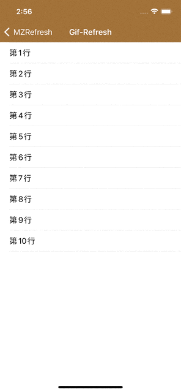

# MZRefresh
Swift下拉刷新、上拉加载组件，简单易用，适用于UIScrollView、UITableView、UICollectionView等继承于UIScrollView的组件。

<table>

<tr>
<th>下拉刷新</th>
<th>上拉加载</th>
</tr>

<tr>
<td></td>
<td></td>
</tr>

</table>

#### 使用
这里使用UIScrollView为例

- 添加刷新组件
```
// 添加下拉刷新组件
scrollView.setRefreshHeader(MZRefreshNormalHeader(beginRefresh: {
    // 请求数据，请求到数据后记得停止刷新动画
    self?.loadNew()
}))
// 添加上拉加载组件
scrollView.setRefreshFooter(MZRefreshNormalFooter(beginRefresh: {
    // 请求数据，请求到数据后记得停止刷新动画
    self?.loadMore()
}))

func loadNew() {
    // 请求数据，刷新页面
    // 停止下拉刷新动画
    scrollView.stopHeaderRefreshing()
}

func loadMore(_ count: Int) {
    // 请求数据，刷新页面
    // 停止上拉加载动画
    scrollView.stopFooterRefreshing()
}
```

- 移除刷新组件
```
// 移除下拉刷新组件
scrollView.removeRefreshHeader()
// 移除上拉加载组件
scrollView.removeRefreshFooter()
```

- 手动刷新或加载更多
```
// 手动触发下拉刷新
// animated代表是否执行动画
self.scrollView.startHeaderRefreshing(animated: true)

// 手动触发上拉加载
// animated代表是否执行动画
self.scrollView.startFooterRefreshing(animated: true)
```

- 停止刷新动画
```
// 停止下拉刷新动画
scrollView.stopHeaderRefreshing()
// 停止上拉加载动画
scrollView.stopFooterRefreshing()
```


#### MZRefreshNormalHeader & MZRefreshNormalFooter

- 刷新组件初始化
```
// 下拉刷新组件
// type         刷新动画类型
// color        刷新动画颜色
// showTime     是否显示上次刷新时间
// beginRefresh 刷新回调
MZRefreshNormalHeader(type: .lineSpinFadeLoader, color: .brown, showTime: true, beginRefresh: {
    
})

// 上拉加载组件
// type         刷新动画类型
// color        刷新动画颜色
// beginRefresh 刷新回调
MZRefreshNormalFooter(type: .lineSpinFadeLoader, color: .brown, beginRefresh: {
    
})
```

- 动画类型
<table>

<tr>
<th>1</th>
<th>2</th>
<th>3</th>
</tr>

<tr>
<td></td>
<td></td>
<td></td>
</tr>

</table>

#### MZRefreshGifHeader & MZRefreshGifFooter

- 刷新组件初始化
```
// 下拉刷新组件
// images               gif分解图片数组
// size                 gif图片显示大小
// animationDuration    是否显示上次下拉刷新时间
// showTime             gif动画时间
// beginRefresh         刷新回调
MZRefreshGifHeader(images: animationImages, size: 60, animationDuration: 1.0, showTime: true, beginRefresh: {
    
})

// 上拉加载组件
// images               gif分解图片数组
// size                 gif图片显示大小
// animationDuration    是否显示上次下拉刷新时间
// beginRefresh         刷新回调
MZRefreshGifFooter(images: animationImages, size: 60, animationDuration: 1.0, beginRefresh: {
    
})


// 下拉刷新组件
// images               gif图片Data
// size                 gif图片显示大小
// animationDuration    是否显示上次下拉刷新时间
// showTime             gif动画时间
// beginRefresh         刷新回调
MZRefreshGifHeader(gifImage: data, size: 40, animationDuration: 1.0, showTime: true, beginRefresh: {
    
})

// 上拉加载组件
// gifImage             gif图片Data
// size                 gif图片显示大小
// animationDuration    是否显示上次下拉刷新时间
// beginRefresh         刷新回调
MZRefreshGifFooter(gifImage: data, size: 40, animationDuration: 0.0, beginRefresh: {
    
})

// gif图片Data获取方式如下
let path = Bundle.main.path(forResource: "1", ofType: "gif")!
let data = try! Data(contentsOf: URL(fileURLWithPath: path))
```

<table>

<tr>
<th>下拉刷新</th>
<th>上拉加载</th>
</tr>

<tr>
<td></td>
<td></td>
</tr>

</table>

